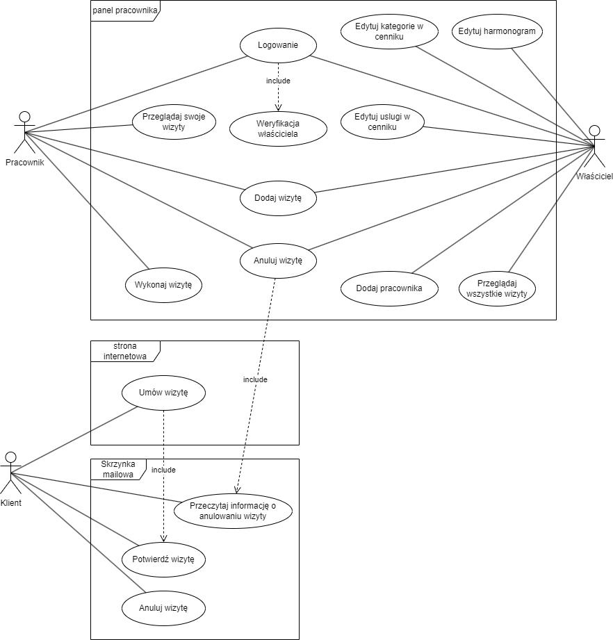
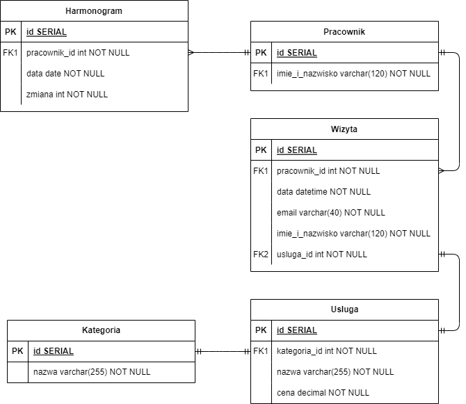

# System umawiania wizyt dla salonu Barber Shop Deluxe

Wersja: v1.0

Autor: Jakub Irla

## Spis treści

1. [Cel aplikacji](#cel-aplikacji)
3. [Cel biznesowy](#cel-biznesowy)
4. [Korzyści z wdrożenia](#korzyści-z-wdrożenia)
5. [Charakterystyka użytkowników](#charakterystyka-użytkowników)
8. [Wymagania](#wymagania)
   * [funkcjonalne](#funkcjonalne)
   * [niefunkcjonalne](#niefunkcjonalne)
5. [Rozplanowanie prac w czasie](#rozplanowanie-prac-w-czasie)
6. [Projekt graficzny](#projekt-graficzny)
7. [Technologie](#technologie)
9. [Wycena](#wycena)

## Cel aplikacji

Celem aplikacji jest usprawnienie procesu umawiania wizyt oraz zarządzania harmonogramem pracy i cennikiem. Dzięki temu, firma może lepiej zarządzać swoim czasem i zasobami oraz zwiększyć swoją efektywność. Aplikacja ma na celu także poprawę jakości obsługi klienta, dzięki łatwiejszemu i szybszemu umawianiu wizyt oraz lepszemu zarządzaniu informacjami o preferencjach i potrzebach klientów. Dodatkowo, system potwierdzania wizyty przez link w mailu, mailowe przypomnienie dzień przed wizytą o jej terminie oraz automatyczna informacja w przypadku anulowania wizyty przez właściciela, wpływa na poprawę komunikacji z klientami i zwiększenie ich zadowolenia.

## Cel biznesowy

Barber Shop Deluxe jest renomowanym salonem fryzjerskim działającym na rynku od 2006 roku. Brakuje jej jednak odpowiedniego systemu, który uprościłby proces komunikacji klientów z firmą, szczególnie w sprawie umawiania wizyt oraz zarządzania nimi przez właściciela.

Proponowane rozwiązanie umożliwi usprawnienie procesu umawiania wizyt, zwiększenie efektywności wykorzystania czasu oraz poprawa komunikacji z klientami. Poprzez zastosowanie systemu rezerwacji terminów zintegrowanego z harmonogramem pracy firmy oraz cennikiem, właściciel salonu będzie miał lepszą kontrolę nad przepływem klientów i zasobów, minimalizując zaangażowanie pracowników w ten proces. Z kolei, klientom zostanie zapewniona wygoda i łatwość w umawianiu wizyt, a także pewność co do potwierdzenia terminu. Wdrożenie tej aplikacji pozwoli na zwiększenie liczby wykorzystanych rezerwacji oraz poprawę relacji z klientami, co w efekcie przyczyni się do zwiększenia przychodów i rozwoju firmy.

## Korzyści z wdrożenia

Przede wszystkim, aplikacja usprawni proces rezerwacji wizyt przez klientów, co wpływa na pozytywną opinię o firmie i zwiększa szanse na pozyskanie nowych klientów. Dzięki systemowi umawiania wizyt zintegrowanemu z harmonogramem pracy, salon może zaplanować swój czas i zminimalizować ryzyko przeciążenia grafiku. Ponadto, możliwość zarządzania cennikiem przez właściciela pozwala na łatwe wprowadzanie zmian oraz dostosowanie oferty do aktualnych potrzeb rynku.

System potwierdzania wizyty przez link w mailu oraz mailowe przypomnienia o terminie wizyty zwiększają skuteczność rezerwacji oraz minimalizują liczbę nieobecności klientów. Dodatkowo, automatyczne powiadomienie o anulowaniu rezerwacji w salonie uniemożliwia występowanie problemów z niezrealizowanymi wizytami, a także minimalizuje ryzyko utraty klienta, przez jednoczesne zaproponowanie terminów zastępczych.

Wprowadzenie powyższej aplikacji ma zatem na celu zwiększenie efektywności, lepszą organizację pracy w salonie i minimalizację strat, a także poprawę jakości obsługi klientów, co przekłada się na wzrost zadowolenia klientów oraz zwiększenie przychodów firmy.

## Charakterystyka użytkowników

Aplikacja dla salonu fryzjerskiego będzie przeznaczona dla trzech grup użytkowników: klientów, właściciela i pracowników. Wszyscy z nich będą mieli dostęp do informacji o dostępności wizyt, cenniku i harmonogramie pracy.

Klienci to główni użytkownicy aplikacji, którzy będą korzystać z niej w celu umawiania wizyt, przeglądania cennika i zarządzania swoimi preferencjami. Klienci oczekują łatwego i intuicyjnego interfejsu użytkownika, który pozwoli im szybko i bezproblemowo umówić wizytę w dogodnym dla nich terminie, zgodnie z harmonogramem pracy salonu.

Właściciel salonu będzie korzystał z aplikacji w celu zarządzania harmonogramem pracy i cennikiem. Będzie mógł modyfikować cennik, dodawać lub usuwać usługi, a także nadzorować realizację rezerwacji, bądź też anulować je w wygodny sposób w przypadku nagłych zdarzen. Właściciel oczekuje, że aplikacja pozwoli mu lepiej zarządzać swoim biznesem i zwiększyć jego efektywność.

Pracownicy salonu fryzjerskiego będą korzystać z aplikacji w celu korzystania z listy wizyt, by zarządzać swoją pracą, dodawania wizyt rezerwowanych telefonicznie lub w salonie. Pracownicy oczekują, że aplikacja będzie intuicyjna i łatwa w obsłudze, co pozwoli im skupić się na swojej pracy i zapewnić klientom wysoką jakość obsługi.

Podane relacje zaprezentowane na schemacie systemu, w formie graficznej przedstawiono na diagramie przypadków użycia:

## Wymagania

### Funkcjonalne
* Jako klient chcę zarezerwować wizytę w wybranym terminie, żeby mieć pewność, że zostanę obsłużony w dogodnym dla mnie czasie.
* Jako klient chcę umawiać wizyty online, żeby zaoszczędzić czas i uniknąć oczekiwania w kolejce.
* Jako klient chcę móc wybrać usługę fryzjerską z cennika, żeby mieć pełną kontrolę nad kosztami.
* Jako klient chcę móc otrzymać przypomnienie o nadchodzącej wizycie drogą mailową, żeby nie zapomnieć o umówionej wizycie.
* Jako klient chcę otrzymywać potwierdzenie wizyty w formie mailowej z linkiem do potwierdzenia, żeby mieć pewność, że wizyta została umówiona i potwierdzona.
* Jako właściciel salonu chcę mieć dostęp do harmonogramu pracy pracowników, żeby móc zarządzać wizytami i dostosowywać grafik do zapotrzebowania klientów.
* Jako właściciel salonu chcę mieć możliwość aktualizowania cennika usług, żeby dostosować go do zmieniających się potrzeb klientów i rynku.
* Jako właściciel chcę mieć możliwość dodawania i edytowania usług w cenniku, żeby mieć aktualne informacje na stronie internetowej i aplikacji.
* Jako pracownik salonu chcę móc zobaczyć harmonogram pracy i informacje o wizycie klienta, żeby być przygotowanym do jego obsługi.

### Niefunkcjonalne

* Aplikacja powinna zapewniać płynne i responsywne działanie, nawet przy dużej liczbie użytkowników i obciążeniu systemu.
* Czas ładowania stron i operacji powinien być minimalny.
* Aplikacja powinna spełniać wysokie standardy bezpieczeństwa, zapewniając poufność i integralność danych użytkowników.
* Wszelkie operacje związane z danymi osobowymi powinny być zgodne z przepisami dotyczącymi ochrony prywatności, takimi jak RODO.
* Architektura aplikacji powinna być zaprojektowana w taki sposób, aby łatwo można było dodawać nowe funkcje i moduły w przyszłości.
* Aplikacja powinna być dostępna dla użytkowników przez całą dobę, 7 dni w tygodniu.
* Interfejs użytkownika powinien być intuicyjny i dostępny dla osób z różnym poziomem umiejętności technicznych.

## Model systemu

Poniżej został przedstawiony ogólny pogląd na główne moduły systemu i dostęp użytkowników do nich, a także modele bazy danych oraz klas użytych w trakcie realizacji projektu.

Moduły systemu:

  * System umawiania wizyt: Pozwala klientom na wybór dogodnego terminu wizyty, sprawdzenie dostępności fryzjerów oraz dokonanie rezerwacji. Obejmuje również funkcję potwierdzania wizyty przez link w mailu oraz przypomnienia mailowe o nadchodzących wizytach.
  * Harmonogram pracy: Zapewnia właścicielowi możliwość definiowania harmonogramu pracy dla fryzjerów, uwzględniając godziny otwarcia, przerwy i dostępność poszczególnych fryzjerów.
  * Cennik: Przechowuje informacje o usługach fryzjerskich oferowanych przez salon wraz z odpowiadającymi im cenami. Właściciel może zarządzać tymi informacjami i wprowadzać zmiany w cenniku.
  * Powiadomienia: System generuje automatyczne powiadomienia, takie jak przypomnienia o wizycie klientowi, potwierdzenia rezerwacji oraz informacje o anulowanych wizytach, przesyłane za pomocą poczty mailowej.
  
Interfejs użytkownika:

  * Panel klienta: Klienci mają dostęp do strony głównej, gdzie mogą przeglądać cennik i harmonogram działania oraz rezerwować wizyty.
  * Panel administracyjny: Właściciel posiada dostęp do panelu administracyjnego, gdzie może zarządzać harmonogramem pracy, cennikiem, wizytami klientów oraz je anulować.

Baza danych

Diagram klas

## Rozplanowanie prac w czasie

Planowany czas realizacji projektu obejmuje okres od 22.05.2023 do 18.06.2023 

Poniżej przedstawiono szczegółowy graficzny plan prac w postaci wykresu Gantta.

## Projekt graficzny

Aplikacja dla salonu fryzjerskiego będzie charakteryzować się estetycznym i nowoczesnym wyglądem, który odzwierciedli profesjonalizm i styl salonu.

* Kolorystyka używana w aplikacji

  

* Fonty używane w aplikacji

  - Montserrat - font  główna

    

  - Cormorant Garamond - font dekoracyjny

    
    
* Projekt graficzny

  Projekt graficzny jest dostępny pod adresem: https://www.figma.com/file/1WVTnyhyFKeyWoimrTI24Y/Zak%C5%82ad-fryzjerski?type=design&node-id=0%3A1&t=dEzguPdCfJvO9JP2-1, a także w plikach panel_administratora.pdf i panel_klienta.pdf, znajdujących się w katologu głównym.

## Technologie

Powyższa aplikacja zostanie opracowana przy użyciu następujących technologii:
* frameworku JavaScript Astro - do sporządzenia statycznej części strony
* frameworku JavaScript React - do stworzenia interaktywnych elementów projektu
* frameworku Node.js Nest - do przygotowania API, stanowiącego część backendową aplikacji
* preprocesora CSS Sass - do responsywnego zrealizowania projektu graficznego

## Wycena

Projekt zakłada stworzenie kompleksowej aplikacji salonu fryzjerskiego, która będzie obejmować system umawiania wizyt, harmonogram pracy, zarządzanie cennikiem i inne funkcje opisane wcześniej. Na podstawie zakresu projektu i przyjętych wymagań, całkowity koszt realizacji mieści się w przedziale od 40 000 do 50 000 zł (ok. 200 godz. pracy).
